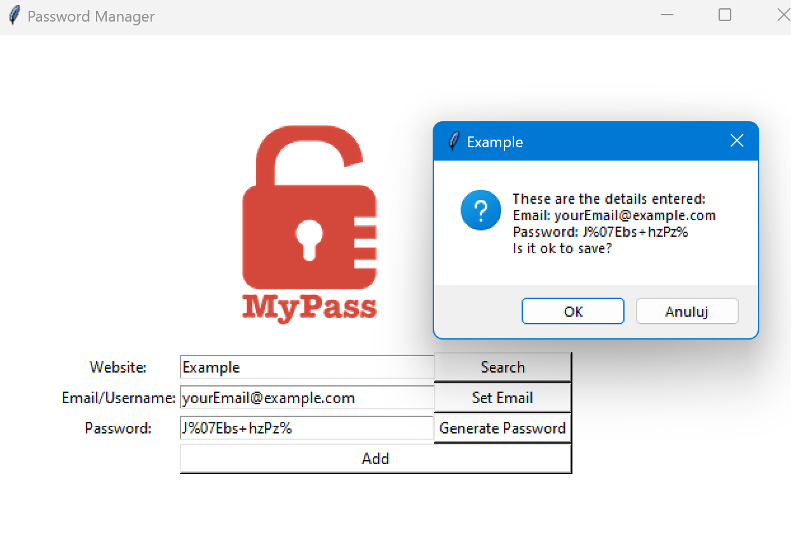

# Simple password manager with basic validation

## part of 100days of code Bootcamp

### created with tkinter module

## To use it:
    - you need to have python 3 installed on your machine
    - download the repository
    - open terminal in the password-manager folder and run
      `python main.py`

